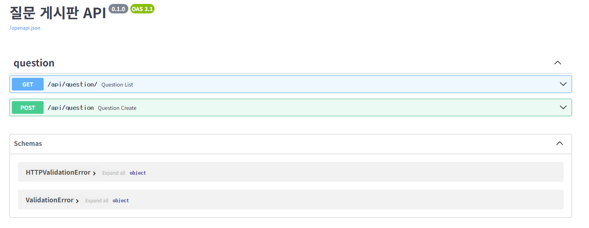

# 문제6 질문 기능을 추가해보자

## 개요

* FastAPI로 REST API 제공
* SQLAlchemy ORM + SQLite 영속 저장
* 정적 프론트 `frontend/`를 FastAPI가 직접 서빙
* 문서: `/docs`

## 구조

```
.
├── main.py                     # FastAPI 앱 엔트리, 정적 서빙/라우터 등록
├── database.py                 # DB 연결/세션/베이스
├── models.py                   # ORM 모델(Question)
├── domain/
│   ├── __init__.py
│   └── question/
│       ├── __init__.py
│       └── question_router.py  # APIRouter(prefix="/api/question")
└── frontend/
    └── index.html              # 간단한 게시판 UI
```

## 설치

```bash
pip install fastapi uvicorn sqlalchemy
```

## 실행

프로젝트 **루트에서** 실행해야 상대경로 DB(`app.db`)가 올바르게 생성/사용됨.

```bash
uvicorn main:app --reload
# 프런트: http://127.0.0.1:8000
# 문서:   http://127.0.0.1:8000/docs
```

## 엔드포인트

* `GET /api/question` 또는 `GET /api/question/` : 질문 목록
* `POST /api/question` : 질문 생성(본문: `{"subject":"...", "content":"..."}`)

### 예시(curl)

```bash
# 목록
curl -s http://127.0.0.1:8000/api/question | jq

# 생성
curl -s -X POST http://127.0.0.1:8000/api/question \
  -H "Content-Type: application/json" \
  -d '{"subject":"테스트","content":"내용"}' | jq
```

## 데이터베이스

* SQLite 파일: `app.db` (루트에 생성)
* 세션: `sessionmaker(autocommit=False, autoflush=False)`
* 초기 개발 편의로 `Base.metadata.create_all(bind=engine)` 사용

## 프런트엔드

* `frontend/index.html`을 FastAPI가 정적으로 서빙
* 같은 오리진에서 `/api/question` 호출 → CORS 불필요


## SQLite GUI 확인

* DB Browser for SQLite 설치 후 `app.db` 열기

## 실행화면
* 메인화면

* /docs 화면

