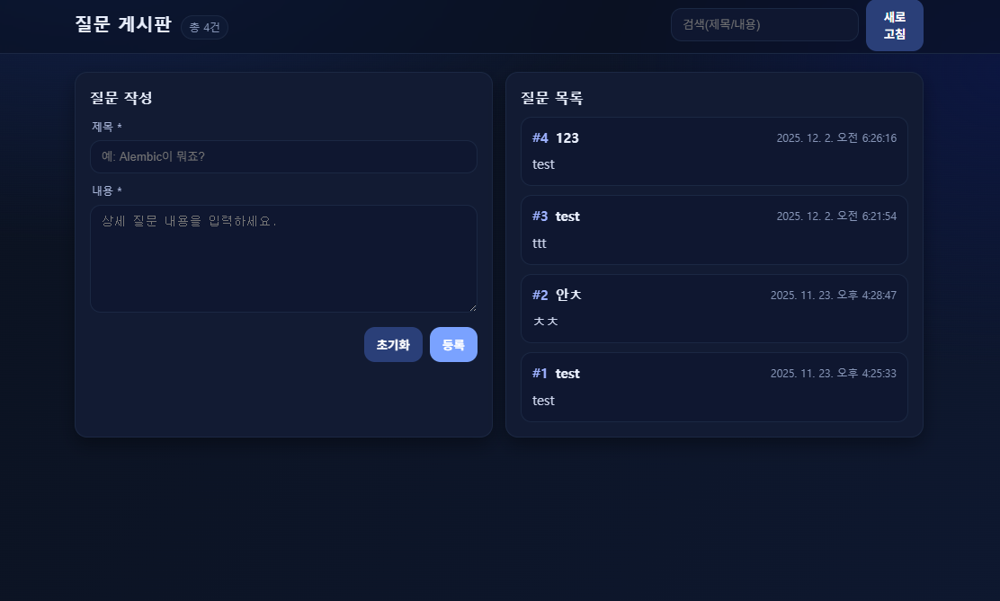
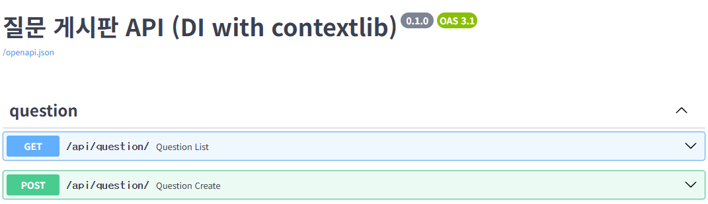

# 문제7 또 다시 알 수 없는 오류

---

## 프로젝트 구조

```
.
├── main.py                         # FastAPI 앱 엔트리, 정적 서빙/라우터 등록
├── database.py                     # DB 연결/세션/베이스 + contextlib DI(get_db, get_db_dep)
├── models.py                       # ORM 모델(Question)
├── domain/
│   ├── __init__.py
│   └── question/
│       ├── __init__.py
│       ├── question_router.py      # APIRouter(prefix="/api/question"), GET/POST
│       └── schemas.py              # Pydantic v2 스키마(QuestionCreate, QuestionOut)
└── frontend/
    └── index.html                  # 간단한 게시판 UI (동일 오리진에서 API 호출)
```

---

## 설치

```bash
pip install fastapi uvicorn sqlalchemy pydantic
```

---

## 실행

프로젝트 **루트에서** 실행해야 SQLite 파일(`app.db`)이 올바르게 생성/사용됨.

```bash
uvicorn main:app --reload
# 프런트: http://127.0.0.1:8000
# 문서:   http://127.0.0.1:8000/docs
```

---

## 핵심 변경 사항 요약

1. **의존성 주입 (contextlib)**

   * `database.py`

     * `@contextmanager def get_db():` → `with get_db() as db:` 사용 시 자동 `close()`
     * FastAPI 전용 어댑터 `def get_db_dep():` 추가 → `Depends(get_db_dep)`로 주입
2. **Pydantic v2 스키마**

   * `schemas.py`

     * `QuestionOut`에 `model_config = ConfigDict(from_attributes=True)` 사용
       (`orm_mode=True`의 v2 이름)
     * `QuestionCreate`로 입력 검증
3. **라우터 경로/메서드**

   * `APIRouter(prefix="/api/question")`
   * 목록 `GET /api/question`(빈 경로 `""`와 `"/"` 모두 등록)
   * 생성 `POST /api/question`(빈 경로 `""`와 `"/"` 모두 등록)
   * `main.py`에서 **추가 prefix 붙이지 않음** (`app.include_router(question_router)`)

---

## 엔드포인트

* `GET /api/question` 또는 `GET /api/question/` : 질문 목록
* `POST /api/question` 또는 `POST /api/question/` : 질문 생성
  요청 본문(JSON): `{"subject":"...", "content":"..."}`

### 예시(curl)

```bash
# 목록
curl -s http://127.0.0.1:8000/api/question | jq

# 생성
curl -s -X POST http://127.0.0.1:8000/api/question \
  -H "Content-Type: application/json" \
  -d '{"subject":"테스트","content":"내용"}' | jq
```

---

# 실행


---

